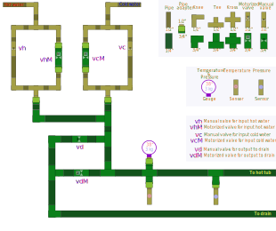

# System Requirements
This document (SRD) provides information about what environment and hardware will be needed to make this product work.

## Hardware requirements

In general to make this product work these hardware modules will be needed.

Table column description:
  * __Hardware Id__ A short, unique, one word name of the hardware or device in question.
  * __Name__ Name of the part.
  * __Units__ How many peases of this kind of part is needed.
  * __R__ For what release is this parted needed.  Read about [Releases].

|  Hardware Id         | Name                                            | Units |   R   | The device is needed because                                         |
|:--------------------:|-------------------------------------------------|:------:|-------|---------------------------------------------------------------------|
| [esp32]              | ESP32 Development Board                         |   1    | [0.5] | Control everything                                                  |
| [temperature_sensor] | DS18B20 3/4" temperature sensor                 |   2    | [0.5] | Provide water temperature in the outgoing pipe                      |
| [pwm_to_voltage]     | PWM to Voltage Converter Module                 |   3    | [0.5] | Allow esp32 to control the valves                                   |
| [proportional_valve] | Proportional Valve Brass controllable with 0-5V |   3    | [0.5] | Allow esp32 to control the valves                                   |
| [lcd_touch_display]  | 2.8" LCD Touch Display                          |   1    | [0.5] | To pass user information and get input from user                    |
| [12v_power_supply]   | 12 volt power supply                            |   1    | [0.5] | Power the three [pwm_to_voltage] and the three [proportional_valve] |
| [5v_power_supply]    | 5 volt power supply                             |   1    | [0.5] | Power [esp32], [temperature_sensor] and [pressure_sensor]           |
| [3v3_power_supply]   | 3.3 volt power supply                           |   1    | [0.5] | Power [lcd_touch_display]                                           |
| [pressure_sensor]    | 60 psi pressure sensor                          |   1    | [1.1] | Needed to test the water level of the hot tub                       |
| [bc337_transistor]   | BC337 Transistor                                |   1    | [1.1] | Needed to dim the backlight on the LCD display                      |

## The Plumbing

This diagram shows the general idea, on where the electric valves and sensors should be located in the water pipe system.

 ### Related pages
 * [Readme]
 * [Product requirements]
 * [System requirements]
 * [Product requirements]
 * [User stories]
 * [Hardware]
 * [Releases]

[Readme]: ../../README.md
[Product requirements]: ./productRequirements.md
[System requirements]: ./systemRequirements.md
[User stories]: ./userStories.md
[Hardware]: ./hardware.md
[Releases]: ./releases.md

[0.5]: ./releases.md#release-05---bare-minimum
[0.6]: ./releases.md#release-06--hardware-installed
[0.7]: ./releases.md#release-07---additional-features
[0.8]: ./releases.md#release-08---remote-access
[0.9]: ./releases.md#release-09---boxed
[1.0]: ./releases.md#release-10
[1.1]: ./releases.md#release-11

[esp32]: ./hardware.md#esp32
[temperature_sensor]: ./hardware.md#temperature_sensor
[pwm_to_voltage]: ./hardware.md#pwm_to_voltage
[proportional_valve]: ./hardware.md#proportional_valve
[lcd_touch_display]: ./hardware.md#lcd_touch_display
[12v_power_supply]: ./hardware.md#12v_power_supply
[5v_power_supply]: ./hardware.md#5v_power_supply
[3v3_power_supply]: ./hardware.md#3v3_power_supply
[pressure_sensor]: ./hardware.md#pressure_sensor
[bc337_transistor]: ./hardware.md#bc337_transistor

